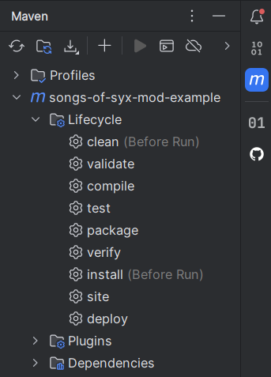

**For V70**

This project is intended for people who want to start modding for the game [Songs of Syx](https://store.steampowered.com/app/1162750/Songs_of_Syx/).
It contains a random weather eclipse event, which changes the light color.
The maven build pipeline will take care of compiling, packaging and installing the mod into the games mod folder.

You will need a **Java 1.8 JDK** for developing.
There are also some [tips for developing a mod](/doc/index.md).


# Prerequisite

:warning: Game installation and mod directory paths are configured in the [pom.xml](pom.xml) in `<profiles>` and are default set to:

**Game Installation**
* **Windows:** `C:\Program Files (x86)\Steam\steamapps\common\Songs of Syx`
* **Linux:** `~/.steam/steam/steamapps/common/Songs of Syx`

**Mod Directory**
* **Windows:** `${user.home}/AppData/Roaming/songsofsyx/mods/`
* **Linux:** `~/.local/share/songsofsyx/mods/`

**[Mod Uploader](https://cdn.discordapp.com/attachments/664478122347069441/1023961932476186704/Songs_of_Syx_Workshop_Uploader.zip?ex=67ef419c&is=67edf01c&hm=9c4cb16f1e6b6007000c8fb07392bc997e44f880614340bc2035d1d4431b4da7&)**
* **Windows:** `${user.home}/AppData/Roaming/songsofsyx/mods-uploader/`
* **Linux:** `~/.local/share/songsofsyx/mods-uploader/`

:warning: You may have to adjust these paths accordingly.

# Setup for Intellij IDEA

[Setup IntelliJ IDEA](doc/howto/intellij_setup.md)

# Getting started

:information_source: [Maven](https://maven.apache.org/) is required to compile, package and install the mod.
When using [IntelliJ IDEA](https://www.jetbrains.com/idea/download/), Maven is already bundled within.

You can run the Maven commands via the `m` icon on the right-hand side in the IntelliJ IDEA UI:



#### 1. Install the game jar file as [local maven dependency](https://www.baeldung.com/maven-local-repository) by copying it from the game installation folder.
```
mvn validate 
```

:information_source: You only have to run `validate` once (or when the games got an update you need)

#### 2. Compile mod source code; build jar file; prepare mod file structure; copy mod files and jar to game mod directory
```
mvn install 
```

#### 3. Run the game, and you should see a `Example Mod` mod. Activate it and launch.

# Run the game from within your IDE (IntelliJ IDEA)

There are three different "Run Configurations" in the `.run` folder:

* `DEBUG` for running the game with debug capabilities via the little green bug icon
* `Main` for running the game and skipping the launcher
* `MainLaunchLauncher` for running the game with launcher

You may have to *edit the game installation paths* in these files.
Intellij should automatically recognize these files and add them to your "Run Configuration" selection.
It is usually found in the upper right-hand corner.
You can select the command via the dropdown menu and run them with the play icon.
The green bug icon will run the game with debug capabilities. This will only work with the `DEBUG` run configuration though.

**DEBUG.run.xml**
```xml
    <classpathModifications>
      <entry path="C:\Program Files (x86)\Steam\steamapps\common\Songs of Syx\base\script\Examples.jar" />
      <entry path="C:\Program Files (x86)\Steam\steamapps\common\Songs of Syx\base\script\Tutorial.jar" />
      <entry path="$PROJECT_DIR$\target\Example Mod.jar" />
    </classpathModifications>
```

For debugging Java code, some additional **classpathModifications** are necessary. 
These can differ on your system. 
Also, the name of your built `*.jar` file may be different.

# Mod SDK (Optional)

See [Mod SDK Setup](doc/howto/mod_sdk_setup.md)

# Start making your own mod

See [make your own mod](doc/howto/make_your_own_mod.md).

# Build commands

:information_source: Installs only the games `SongsOfSyx.jar` and `info/SongsOfSyx-sources.jar` as a dependency, and validate whether it was successful.
```
mvn validate
```

:warning: This is required or the project won't find the games code.

:information_source: Building the mod only into `target/out`:
```
mvn package
```

The source code of the mod will be copied into e.g. `target/out/songs-of-syx-mod-example/V63/script/_src`.

:information_source: Build and copy the output into the games mods folder (excluding `_src`):
```
mvn install
```

:warning: The game mod folder location varies on each OS.
There are maven profiles "windows" and "linux". The "windows" profile is the default.
Maven should detect when you are building on a Linux OS and switch to the "linux" profile (not tested).
You can force a profile with e.g.

```
mvn install -P linux
```

:information_source: Deletes the `target` directory containing the packaged mod files and removes the mod from the games mod directory.
```
mvn clean
```

# Mod Info / Build Settings

In the [pom.xml](pom.xml) you will find `<properties>` where you can change information about the mod.
There you can also change the `<game.version.major>` property to your used game version.
The `<game.version.minor>` property is only important when your mod really depends on stuff in this version and isn't compatible with lower versions.

Files (e.g. assets) for the mod are located in `src/main/java/resources/mod-files` and will be copied in the `package` phase.

# Debugging

You can enable **Debug Mode** and **Developer Mode** in the game launcher **settings**.
You will get more detailed logs and in-game developer tools for testing.

## Eclipse

* Add a new [Run Configuration](https://www.subjectcoach.com/tutorials/detail/contents/beginners-guide-to-eclipse-ide/chapter/working-with-run-configurations).
* Set the **main class** name to `init.MainLaunchLauncher`.
* In the tab **Arguments** set the **working directory** to your game installation folder e.g. `C:/Program Files (x86)/Steam/steamapps/common/Songs of Syx`.

## Testing

There's [JUnit 5](https://junit.org/junit5/) with [AssertJ](https://assertj.github.io/doc/) and [Mockito 4](https://site.mockito.org/) for testing your code.

## Developing Tips

See [doc/index.md](doc/index.md).

## Publish your Mod

There's a maven profile `mods-uploader` you can use to automatically copy and clean your files into the mod uploader.
The directory is configurable via the `<game.mod.uploader.directory>` property in the `<profiles>` in the [pom.xml](pom.xml). 

Default set to:

* **Windows:** `${user.home}/AppData/Roaming/songsofsyx/mods-uploader`
* **Linux:** `${user.home}/.local/share/songsofsyx/mods-uploader`

Will copy the mod files into the [Steam Workshop Uploader](https://cdn.discordapp.com/attachments/664478122347069441/1023961932476186704/Songs_of_Syx_Workshop_Uploader.zip?ex=67ef419c&is=67edf01c&hm=9c4cb16f1e6b6007000c8fb07392bc997e44f880614340bc2035d1d4431b4da7&) directory.

```
mvn install -P mods-uploader
```

Will remove the mod files from the mod uploader. For updating the mod files.

```
mvn clean -P mods-uploader
```

### Steam

* [Official How to up- and download mods using Steam Workshop](https://steamcommunity.com/sharedfiles/filedetails/?id=2229540768)
* [(Discord) Steam Workshop Uploader](https://cdn.discordapp.com/attachments/664478122347069441/1023961932476186704/Songs_of_Syx_Workshop_Uploader.zip?ex=67adff5c&is=67acaddc&hm=e6c3e2e9cb6e365e61cb69c0cb242be13f2856cf06391d46541f842a6b3902f7&)

# Modding Resources

* [Discord](https://discord.com/eacfCuE)
* [Make a mod](doc/res/MAKE_A_MOD.txt)
* [Script Modding](https://docs.google.com/document/d/1FVOtfr3Y-cxH2Gw-i-OqW3Vbp0MPJp0xSyQ80UoCABE/edit)
* [Modding Guide](https://drive.google.com/file/d/1_OesG68HtJ4CwyHK7M72hQDOaCjeqgqT/view) (OUTDATED)
* [Basic Introduction](https://songsofsyx.old.mod.io/guides/introduction-adding-a-resource)
* [Basic Sprites](https://songsofsyx.old.mod.io/guides/basics-sprites)

# FAQ & Troubleshooting

### How can I read and browse the source code of Songs of Syx?

See: [Setup IntelliJ IDEA](doc/howto/intellij_setup.md)

### What programming language is Songs of Syx written in?

Songs of Syx is written in Java 1.8. 
It is shipped with its own Java Runtime Environment (JRE) found in the game installation directory under `jre/`.

### Which engine is Songs of Syx written in?

Songs of Syx uses a custom engine, especially tinkered for its purpose. 
The engine is not a general purpose city builder engine, but more a Songs of Syx engine :)
It's based on [LWJGL 3.x](https://www.lwjgl.org/) and the game code refers to it as `Snake2D`.

### I am overwhelmed... where shall I start?

Make sure you have a running development environment.
* **See:** [Setup IntelliJ IDEA](doc/howto/intellij_setup.md)

Then you need to be sure of what kind of mod you want to make:

For **adding or changing content** in the game in the form of races, rooms, music, maps, technology, etc. you can extend or replace the game data.
* **See:** [Mod Folder Structure](doc/index.md#mod-folder-structure).

For **adding or changing features** in the game, you have to extend or replace the source code.
* **See:** [Java Package](doc/howto/make_your_own_mod.md#java-package), [Modding Strategy](doc/howto/modding_strategy.md)

### What is Maven and why do I need it?

[Maven](https://maven.apache.org/) is a build tool to compile, test, package and publish your software "artifacts".
It is used for the following things in the mod example:

* Delete (`clean`) the mod files from the game mod directory and mod uploader directory
* Provide (`validate`) the installed game `SongsOfSyx.jar` as Maven dependency
* `compile` and `test` your mod source code
* `package` the built code and your other mod files to the game mod structure
* Copy (`install`) the built mod into the game mod directory
* Copy (`install`) the built mod into the mod uploader directory (optional)
* Add and manage third party dependencies like [Lombok](https://projectlombok.org/) and [JUnit](https://junit.org/junit5/)

The build process follows a certain "[build lifecycle](https://maven.apache.org/guides/introduction/introduction-to-the-lifecycle.html)".
These are the phases:

```
1. compile
2. test
3. package
4. verify
5. install
(6. site)
(7. deploy)
```

If e.g. `package` is executed. It will also run `compile` and then `test`.

### I get cryptic errors when trying to "compile" or "install"

The most common cause is a not matching game major version. 
Check which version of the game you've installed by starting the launcher. 
There you can find the version in the **Info** screen.
You have to set the correct major version in the [pom.xml](pom.xml) file or install the correct game version.

```xml
<properties>
    ...

    <game.version.major>69</game.version.major>
        
    ...
</properties>
```

Additionally, there is a code example,
which may only work specific versions of the game in [src/main/java](src/main/java) and can file when compiling.
You can delete everything in the *java* folder if you don't plan to do any Java coding, or fix the compiling errors. 

After you've done that run:

```
mvn clean validate
```

This will clear all built mod files and re-register SongsOfSyx as dependency with the correct version.
If you use IntelliJ IDEA, you may have
to [Reload All Maven Projects](https://www.jetbrains.com/help/idea/delegate-build-and-run-actions-to-maven.html#reload_all_projects).


# DISCLAIMER

The source code of the "eclipse" example comes from the game files itself and were written by the game dev Jake de Laval.
I just built the maven tooling around it.


