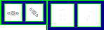
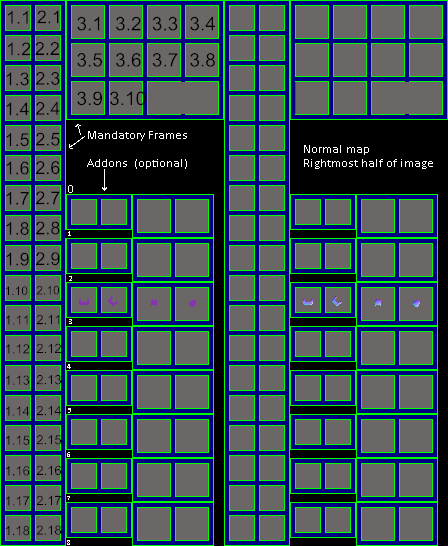
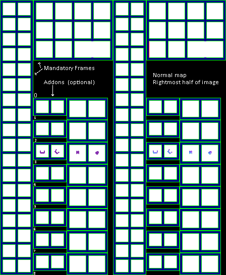

Race sprite sheets can be found at `/data/asset/sprite/race`. In the games `base/data.zip` located in the installation directory.
Each race has their own named sprite sheet. An empty one can be found at [../img/sprite](../img/sprite). Note that the numbered sprite sheet will not work.

## Rundown
The [numbered spritesheet](#Numbered-spritesheet) has the corrosponding numbers. It is a good idea to not only look at this when making a new sprite, but also one of the existing races.  

I've split the sprites into 4 sections.
### 1. Mandatory forward
    1. Standing 1 (Can be empty)
    2. Taking step Variant 1
    3. Standing Variant 2
    4. Taking step Variant 2
    5. Standing Variant 3
    6. ???
    7. Body still
    8. Right arm forward 1
    9. Right arm forward 2
    10. Right arm forward 3
    11. Left arm forward 1
    12. Left arm forward 2
    13. Left arm forward 3
    14. Both arms forward
    15. Both arms to side
    16. Both arms to side wide
    17. Head
    18. Shadow
### 2. Mandatory Diagonally
    1. Standing 1 (Can be empty)
    2. Taking step Variant 1
    3. Standing Variant 2
    4. Taking step Variant 2
    5. Standing Variant 3
    6. ???
    7. Body still
    8. Right arm forward 1
    9. Right arm forward 2
    10. Right arm forward 3
    11. Left arm forward 1
    12. Left arm forward 2
    13. Left arm forward 3
    14. Both arms forward
    15. Both arms to side
    16. Both arms to side wide
    17. Head
    18. Shadow
### 3. Mandatory lying down
    1. Leg forward
    2. Leg diagonally
    3. Clothes forward
    4. Clothes Diagonally
    5. Arms forward
    6. Arms diagonally
    7. Head forward
    8. Head Diagonally
    9. Shadow
    10. Shadow
### 4. Addons  
Addons have 2 pairs of sprites. left side pair is standing up. Right side pair is laying down. The left side on each pair is forward while the right side is diagonally as seen below.  
  
0: Armor  
1: Might be Armor 2  
2: Might be backpack  
3: Hair  
4: Beard  

The rest is unknown and unused for now.
#### Numbered spritesheet

#### Empty race spritesheet
