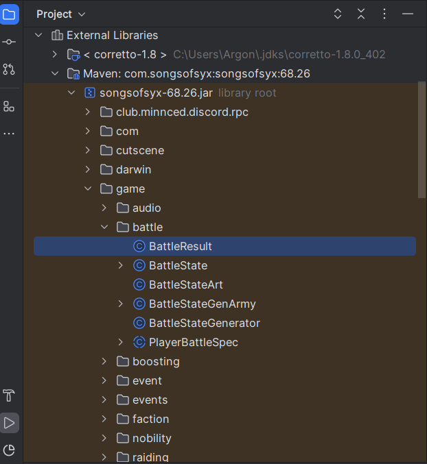

# Setup Intellij IDEA

1) Download and install [Intellij IDEA Community Edition](https://www.jetbrains.com/idea/download/other.html) (**not** Ultimate)


2) Create a `File->New->Project from Version Control` via:

   


3) Enter the git url `https://github.com/4rg0n/songs-of-syx-mod-example.git` and "clone" the repository: 

   


4) Goto `File->Project Structure` and choose to download a JDK:
 
   


5) Choose `Version 21` and a Vendor of your choice and download it: 

   


6) Setup file paths: 

    :warning: Game installation and mod directory paths are configured in the [pom.xml](../../pom.xml) in `<profiles>` and are default set to:

    **Game Installation**
    * **Windows:** `C:\Program Files (x86)\Steam\steamapps\common\Songs of Syx`
    * **Linux:** `~/.steam/steam/steamapps/common/Songs of Syx`

    **Mod Directory**
    * **Windows:** `${user.home}/AppData/Roaming/songsofsyx/mods/`
    * **Linux:** `~/.local/share/songsofsyx/mods/`

    **[Mod Uploader](https://cdn.discordapp.com/attachments/664478122347069441/1023961932476186704/Songs_of_Syx_Workshop_Uploader.zip?ex=67ef419c&is=67edf01c&hm=9c4cb16f1e6b6007000c8fb07392bc997e44f880614340bc2035d1d4431b4da7&)**
    * **Windows:** `${user.home}/AppData/Roaming/songsofsyx/mods-uploader/`
    * **Linux:** `~/.local/share/songsofsyx/mods-uploader/`

    :warning: You may have to adjust these paths accordingly.


7) On the right hand side click on the `M` icon and doubleclick the maven `validate` command: 

   


8) After that run the `install` command

## What is Maven and why do I need it?

[Maven](https://maven.apache.org/) is a build tool to compile, test, package and publish your software "artifacts".
It is used for the following things in the mod example:

* Delete (`clean`) the mod files from the game mod directory and mod uploader directory
* Provide (`validate`) the installed game `SongsOfSyx.jar` as Maven dependency
* `compile` and `test` your mod source code
* `package` the built code and your other mod files to the game mod structure
* Copy (`install`) the built mod into the game mod directory
* Copy (`install`) the built mod into the mod uploader directory (optional)
* Add and manage third party dependencies like [Lombok](https://projectlombok.org/) and [JUnit](https://junit.org/junit5/)

The build process follows a certain "[build lifecycle](https://maven.apache.org/guides/introduction/introduction-to-the-lifecycle.html)".
These are the phases:

```
1. compile
2. test
3. package
4. verify
5. install
(6. site)
(7. deploy)
```

If e.g. `package` is executed. It will also run `compile` and then `test`.

## Problems?

### I get cryptic errors when trying to "compile" or "install"

The most common cause is a not matching game major version.
Check which version of the game you've installed by starting the launcher.
There you can find the version in the **Info** screen.
You have to set the correct major version in the [pom.xml](pom.xml) file or install the correct game version.

```xml
<properties>
    ...

    <game.version.major>69</game.version.major>
        
    ...
</properties>
```

Additionally, there is a code example,
which may only work specific versions of the game in [src/main/java](src/main/java) and can file when compiling.
You can delete everything in the *java* folder if you don't plan to do any Java coding, or fix the compiling errors.

After you've done that run:

```
mvn clean validate
```

This will clear all built mod files and re-register SongsOfSyx as dependency with the correct version.
If you use IntelliJ IDEA, you may have
to [Reload All Maven Projects](https://www.jetbrains.com/help/idea/delegate-build-and-run-actions-to-maven.html#reload_all_projects).


## Reading the games source code

In the project tree on the left-hand site, you will see **External Libraries** at the bottom.
Under this you will find a "Maven" dependency called something like `com.songsofsyx:songsofsyx:XX.XX`.



There you can browse the game source code.
See: [Reading and understanding the Songs of Syx Source Code](game_code.md) for some more information.


## Running the game with the mod

There are three `.xml`files in the [.run](../../.run) folder:

* `Main` launches the game directly
* `MainLaunchLauncher` starts the game launcher
* `DEBUG` starts the game with debug capabilities

You may want to edit the `WORKING_DIRECTORY`and anything in `<classpathModifications>` to your local game installation path.
It's default set to: `C:/Program Files (x86)/Steam/steamapps/common/Songs of Syx`.

For the future: Your package name may also differ in the `PATTERN` option.
It's set default to: `your.mod.*`

They should be automatically available [in the IDE](https://www.jetbrains.com/help/idea/run-debug-configuration.html): 


Run the game at first through the `MainLaunchLauncher` and enable the `Example Mod` in the launcher.
Once the mod is enabled, you can skip the launcher by running the `Main` or `DEBUG` command.
