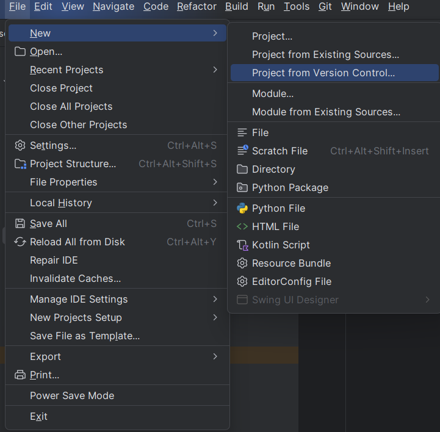
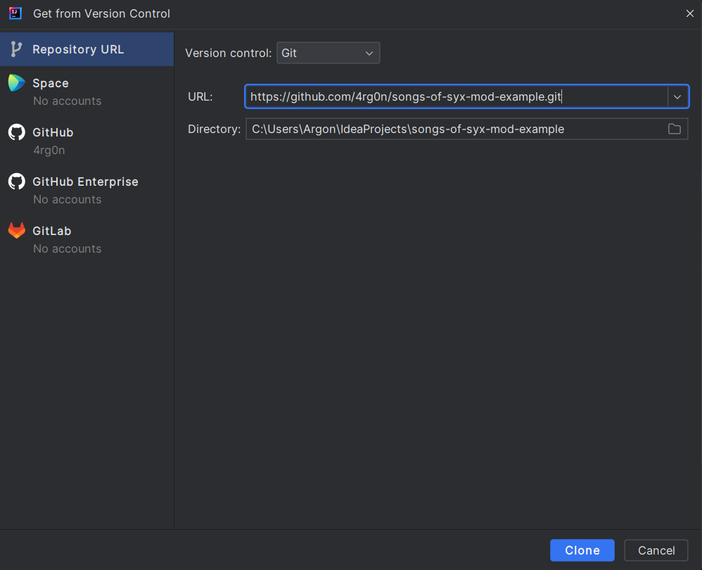
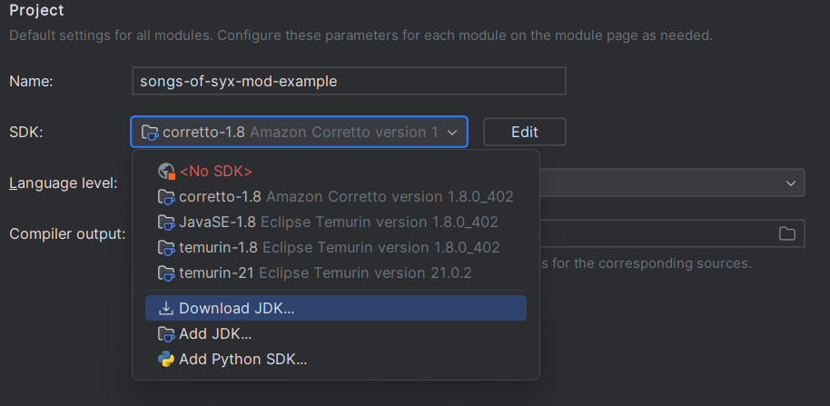
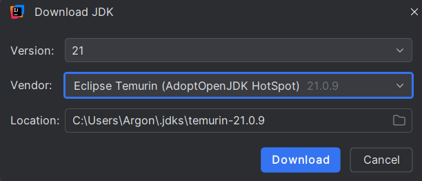
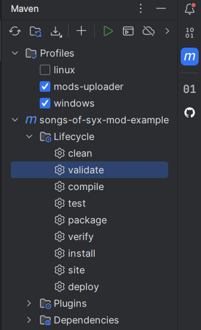
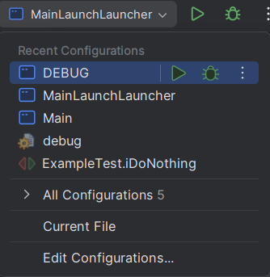

# Setup Intellij IDEA

1) Download and install [Intellij IDEA Community Edition](https://www.jetbrains.com/idea/download) (not Ultimate)
2) Create a `File->New->Project from Version Control` via:

   
3) Enter the git url `https://github.com/4rg0n/songs-of-syx-mod-example.git` and "clone" the repository: 

   
4) Goto `File->Project Structure` and choose to download a JDK:
 
   
5) Choose `Version 1.8` and a Vendor of your choice and download it: 

   
6) Check the [README Prerequisite](../../README.md#prerequisite), for the correct game installation paths
7) On the right hand side click on the `M` icon and doubleclick the maven `validate` command: 

   
8) After that run the `install` command

## Running the game with the mod

There are three `.xml`files in the `.run/` folder:

* `Main` launches the game directly
* `MainLaunchLauncher` starts the game launcher
* `DEBUG` starts the game with debug capabilities

You may want to edit the `WORKING_DIRECTORY`and anything in `<classpathModifications>` to your local game installation path.
It's default set to: `C:/Program Files (x86)/Steam/steamapps/common/Songs of Syx`.

For the future: Your package name may also differ in the `PATTERN` option.
It's default set to: `your.mod.*`

They should be automatically available [in the IDE](https://www.jetbrains.com/help/idea/run-debug-configuration.html): 

Run the game at first through the `MainLaunchLauncher` and enable the `Example Mod` in the launcher.
Once the mod is enabled, you can skip the launcher by running the `Main` or `DEBUG` command.

