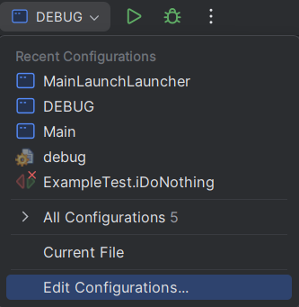
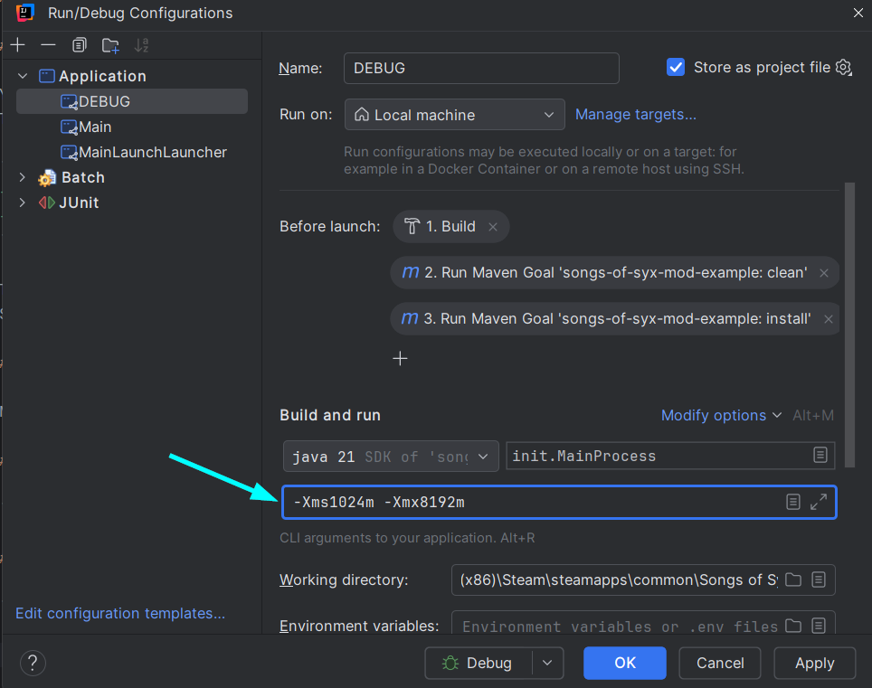

# Passing JVM Arguments

## Via a File

You can place a file called `jvmargs-launcher.txt` next to the `SongsOfSyx.exe` executable.
There you can add options for the Java Virtual Machine like:

```
-Xms1024m
-Xmx8192m
```

This would increase the available memory to 8GB. 
See the [official documentation](https://docs.oracle.com/en/java/javase/21/docs/specs/man/java.html) for all available options.

## Via a Command Line

Navigate into the game installation directory and open a terminal there.

### Linux / MacOS

`./jre/bin/java -jar SongsOfSyx.jar -Xms1024m -Xmx8192m `

## Windows

`.\jre\bin\java.exe -jar SongsOfSyx.jar -Xms1024m -Xmx8192m`

## Via Intellij IDEA

In the upper right hand corner, open the command drop down and choose **Edit Configurations...**.



Select a command and add the JVM arguments.

