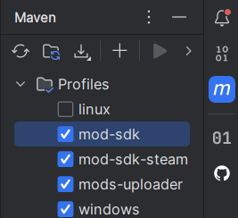
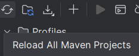

# Mod SDK Setup

The [Mod SDK](https://steamcommunity.com/sharedfiles/filedetails/?id=3331182511) 
can help you to solve common problems you will encounter while coding your mod. Check out the [documentation](https://github.com/4rg0n/songs-of-syx-mod-more-options/tree/main/mod-sdk/src/main/java/com/github/argon/sos/mod/sdk#mod-sdk) for more.

**1)** Enable the `mod-sdk` maven profile:

   

**2)** The `mod-sdk-steam` profile should be enabled by default. This will read the Mod SDK files from the Steam workshop directory.
You have to [subscribe via Steam](https://steamcommunity.com/sharedfiles/filedetails/?id=3331182511), for the files to be present.
If you **disable** `mod-sdk-steam`, it will look into the game mod folder for the Mod SDK instead.

* **Windows:** `${user.home}/AppData/Roaming/songsofsyx/mods`
* **Linux:** `${user.home}/.local/share/songsofsyx/mods`

You have to download the latest `Mod SDK` from the [GitHub Releases](https://github.com/4rg0n/songs-of-syx-mod-more-options/releases) site and extract the mod into the game mod folder.

**3)** Run `mvn clean validate`. This will install the `mod-sdk` as a Maven dependency into the local repository.

**4)** You may have to refresh Maven via the little arrows going in a circle icon:

   

That's it! The Mod SDK should be installed and added as a dependency to the project now.
**Don't forget** to check out the [documentation](https://github.com/4rg0n/songs-of-syx-mod-more-options/tree/main/mod-sdk/src/main/java/com/github/argon/sos/mod/sdk#mod-sdk) for more.

