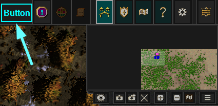
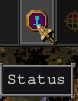
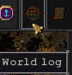
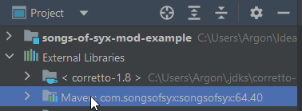
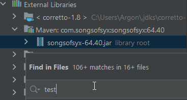
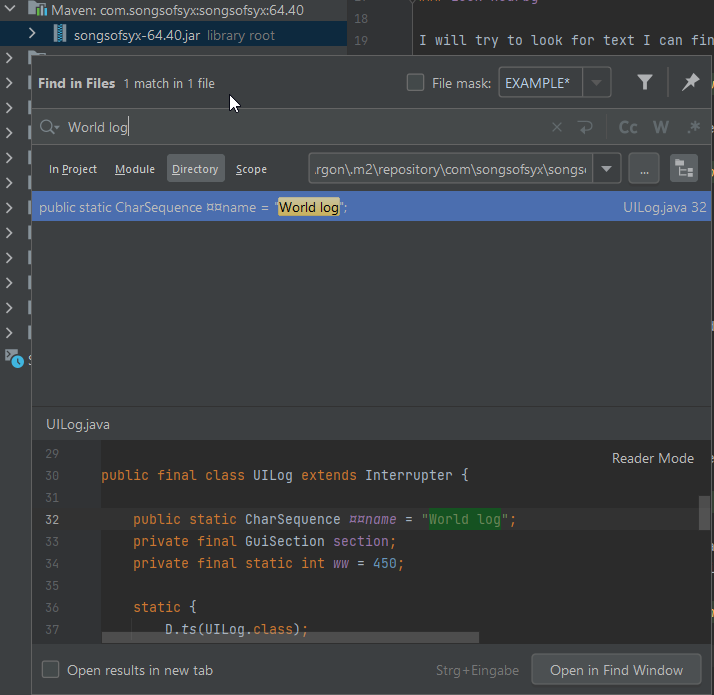
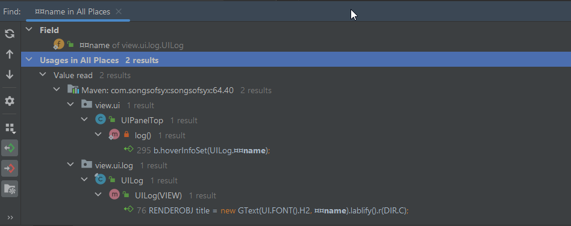
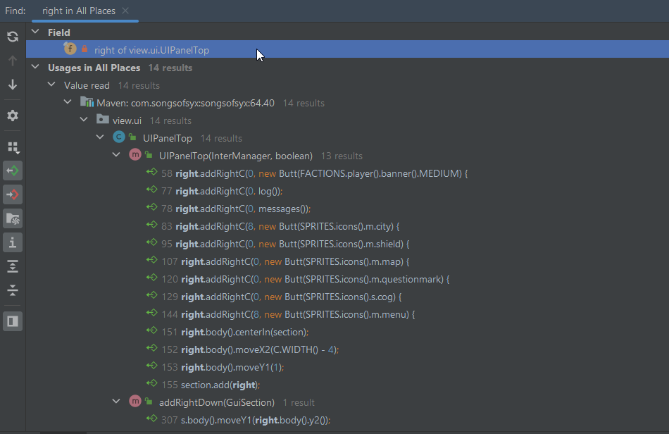

# Modding Strategy

**DISCLAIMER** If you don't know a lot about Java or even about programming at all, this can be a hard challenge to master.

The game code is written how the Dev needed it. It wasn't design to be super reusable and extendable. 
To add or change something in the code can be very tricky, and you will most likely don't even know where to start.
I'll try to explain some techniques I'm using to find and inject stuff into the code. 
I am using the [Intellij IDEA Community Edition](https://www.jetbrains.com/idea/download), which is free.
I won't dictate you what to use and what not, that's just what I'm most comfortable with.

## Journey to add a button

**TASK** Add a clickable button to the top ui panel on the upper right hand side.



### Look nearby

I will try to look for text I can find in the game code nearby the area I want to add something:



"Status" is a very generic word, comes up probably very often in the code... Let's look further



"World log" sounds more promising.

### Search the code

To be able to search the code at all, you will need the `SongsOfSyx.jar` and its `SongsOfSyx-sources.jar`.
The automated maven pipeline will add that for you as a maven artifact via: 

```
mvn validate 
```

You should be able to see it as "External Library" then:



Now you have to expand the artifact and click on the `.jar` file name.
There you will be able to use the "Find in files" command via `CTRL + SHIFT + F`



Now I can search for my "World log"



### Follow the path

When you've found your first entry point, you will need to follow the code flow and structure.
So in my case I will look for usages of `¤¤name` via right click "Find usages" or `ALT + F7`:



It is used in two places: `UIPanelTop` and `UILog`. I guess the first one is the one I am after.
Now I know where this whole panel at the top lives. The next question is how I can add new things to it?

The `UILog.¤¤name` is used for a hover info at the bottom of the `UIPanelTop.log()` method. The method seems to build the button itself:

```java
public class UIPanelTop extends Interrupter {
    
    //...
    
    private static CLICKABLE log() {
        CLICKABLE b = new Butt(SPRITES.icons().m.factions) {
            int current = WORLD.LOG().all().size();

            @Override
            protected void render(SPRITE_RENDERER r, float ds, boolean isActive, boolean isSelected,
                                  boolean isHovered) {
                if (VIEW.b().isActive())
                    return;
                isActive = WORLD.LOG().all().size() > current;

                isSelected = VIEW.UI().log.isActivated();
                super.render(r, ds, isActive, isSelected, isHovered);

            }

            @Override
            protected void clickA() {
                if (!VIEW.b().isActive()) {
                    VIEW.UI().log.activate();
                    current = WORLD.LOG().all().size();
                }
            }
        };
        b.hoverInfoSet(UILog.¤¤name); // this is the tooltip we see when hovering over the button
        return b;
    }
}
```

Another "Find usages" for the `log()` methods shows it is added to a `GuiSection` member variable named `right`:

```java 
public class UIPanelTop extends Interrupter {

    public static final int WIDTH = C.WIDTH();
    public static final int HEIGHT = Icon.M * 2 + 3;

    private final GuiSection section = new GuiSection();
    private final GuiSection time;
    private final GuiSection right = new GuiSection();

    public UIPanelTop(InterManager manager) {

        this(manager, false);
    }

    public UIPanelTop(InterManager manager, boolean battleview) {
        
        // ...
        
        if (!battleview) {
            right.addRightC(0, new Butt(FACTIONS.player().banner().MEDIUM) {
                @Override
                protected void clickA() {
                    VIEW.UI().level.activate();
                }

                @Override
                protected void renAction() {
                    selectedSet(VIEW.UI().level.isActivated());
                    if (!selectedIs() && !hoveredIs()) {
                        if (FACTIONS.player().titles.hasNew()) {
                            bg(COLOR.WHITE2WHITE);
                        }else {
                            bgClear();
                        }
                    }
                };
            }.hoverInfoSet(VIEW.UI().level.¤¤Name));

            right.addRightC(0, log()); // here it is added
            right.addRightC(0, messages());
        }
    }
}
```

This seems the place where we need to add the button to.
Let's check the usage of `right`:



It gets added into another `GuiSection` via `section.add(right);`
There seems to be no getter or other way to read this from outside.
So adding something here the usual way won't work.

### Find access

After you know the where, you have to figure out the how. 
Because `right` is a `GuiSection` too, it's easy to add something to it via e.g. `right.addRight(0, new GButt.ButtPanel("Button"))`. 
But we don't have access to it yet.


// to be continued ...