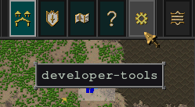
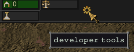

## Howto

A collection of how to mod things in Songs of Syx.

See [howto/index.md](howto/index.md)

## Game Boosters

Boosters are found all over the place in the `.txt` configuration files of the game.
They are mostly under the key `BOOST` or `BONUS`. They follow a special syntax:

```
BOOST: {
	RELIGION_CRATOR>ADD: -1.0,
	RELIGION_AMINION>ADD: -1.0,
	RELIGION_ATHURI>ADD: 0.0,
	RELIGION_SHMALOR>ADD: -1.0,
	PHYSICS_RESISTANCE_COLD>MUL: 2.0,
	PHYSICS_RESISTANCE_HOT>MUL: 0.75,
},
```

```
{BOOSTER_KEY}>{ADD|MUL}: 0.0,
```

* [All possible BOOSTER_KEYs](booster/boosters_all.md)

## In-game Debug and Development Tool

:warning: You have to enable **Debug** and **Developer** in the games Launcher **Settings**.

```java
import view.interrupter.IDebugPanel;

public final class ExampleScript implements SCRIPT {
    
    //...

    @Override
    public SCRIPT_INSTANCE initAfterGameCreated() {
        // adds a command that opens the copier tool
        IDebugPanel.add("Copy Stuff", () -> VIEW.s().ui.copier.activate());

        return new Instance();
    }
}
```

You can find your custom added commands in-game in the `developer-tools`. Located in the upper right corner above the minimap :



There's also another debug panel next to the status bars in the left hand upper corner with some additional commands:



## Logging

```java
import game.GAME;
import snake2d.LOG;

public final class ExampleScript implements SCRIPT {
    
    //...

    @Override
    public SCRIPT_INSTANCE createInstance() {
        // will log the message with a stacktrace
        GAME.Notify("MESSAGE");
        
        // will write a log entry
        LOG.ln("MESSAGE");

        // will write an error log entry
        LOG.err("MESSAGE");

        return new Instance();
    }
}
```

## Static game classes

These classes contain various accessible information and features for the game.

```java

public final class ExampleScript implements SCRIPT {

    //...

    @Override
    public SCRIPT_INSTANCE createInstance() {

        snake2d.CORE;
        view.main.VIEW;
        integrations.INTEGRATIONS;
        
        game.GAME;
        game.VERSION;
        game.battle.BATTLE;
        game.faction.FACTIONS;
        game.time.TIME;
        game.tourism.TOURISM;
        
        settlement.main.SETT;
        settlement.stats.STATS;
        settlement.stats.law.LAW;
        settlement.stats.standing.STANDINGS;

        init.biomes.TERRAINS;
        init.boostable.BOOSTABLES;
        init.C;
        init.D;
        init.disease.DISEASES;
        init.paths.PATHS;
        init.race.RACES;
        init.resources.RESOURCES;
        init.sprite.SPRITES;
        init.sprite.UI.UI;
        init.tech.TECHS;
        
        world.army.WARMYD;
        world.army.WINDU;

        return new Instance();
    }
}
```

## Game and Mod Initialization

When which static game class is available for your mod to use.

### BeforeGameCreated

```java
public class BeforeGameCreatedAvailabilityTest {
    public static void test() {
        testCORE();
        testTERRAINS();
        testPATHS();
        testUI();
        testTECHS();
    }
    
    private static void testTECHS() {
        assertThat(TECHS.INFO()).as("TECHS.INFO()").isNotNull();
    }

    private static void testUI() {
        assertThat(UI.decor()).as("UI.decor()").isNotNull();
        assertThat(UI.FONT()).as("UI.FONT()").isNotNull();
        assertThat(UI.PANEL()).as("UI.PANEL()").isNotNull();
    }

    private static void testPATHS() {
        assertThat(PATHS.BASE()).as("PATHS.BASE()").isNotNull();
        assertThat(PATHS.CONFIG()).as("PATHS.CONFIG()").isNotNull();
        assertThat(PATHS.INIT()).as("PATHS.INIT()").isNotNull();
        assertThat(PATHS.RACE()).as("PATHS.RACE()").isNotNull();
        assertThat(PATHS.CACHE_DATA()).as("PATHS.CACHE_DATA()").isNotNull();
        assertThat(PATHS.CACHE_SCRIPT()).as("PATHS.CACHE_SCRIPT()").isNotNull();
        assertThat(PATHS.CACHE_TEXTURE()).as("PATHS.CACHE_TEXTURE()").isNotNull();
        assertThat(PATHS.DICTIONARY()).as("PATHS.DICTIONARY()").isNotNull();
        assertThat(PATHS.INIT_SETTLEMENT()).as("PATHS.INIT_SETTLEMENT()").isNotNull();
        assertThat(PATHS.INIT_WORLD()).as("PATHS.INIT_WORLD()").isNotNull();
        assertThat(PATHS.local()).as("PATHS.local()").isNotNull();
        assertThat(PATHS.MISC()).as("PATHS.MISC()").isNotNull();
        assertThat(PATHS.NAMES()).as("PATHS.NAMES()").isNotNull();
        assertThat(PATHS.SCRIPT()).as("PATHS.SCRIPT()").isNotNull();
        assertThat(PATHS.SOUND()).as("PATHS.SOUND()").isNotNull();
        assertThat(PATHS.SPRITE()).as("PATHS.SPRITE()").isNotNull();
        assertThat(PATHS.SPRITE_GAME()).as("PATHS.SPRITE_GAME()").isNotNull();
        assertThat(PATHS.SPRITE_SETTLEMENT()).as("PATHS.SPRITE_SETTLEMENT()").isNotNull();
        assertThat(PATHS.SPRITE_SETTLEMENT_MAP()).as("PATHS.SPRITE_SETTLEMENT_MAP()").isNotNull();
        assertThat(PATHS.SPRITE_UI()).as("PATHS.SPRITE_UI()").isNotNull();
        assertThat(PATHS.SPRITE_WORLD()).as("PATHS.SPRITE_WORLD()").isNotNull();
        assertThat(PATHS.TEXT()).as("PATHS.TEXT()").isNotNull();
        assertThat(PATHS.TEXT_CONFIG()).as("PATHS.TEXT_CONFIG()").isNotNull();
        assertThat(PATHS.TEXT_MISC()).as("PATHS.TEXT_MISC()").isNotNull();
        assertThat(PATHS.TEXT_SETTLEMENT()).as("PATHS.TEXT_SETTLEMENT()").isNotNull();
        assertThat(PATHS.TEXT_WORLD()).as("PATHS.TEXT_WORLD()").isNotNull();
        assertThat(PATHS.currentMods()).as("PATHS.currentMods()").isNotEmpty();
    }

    private static void testTERRAINS() {
        assertThat(TERRAINS.INFO()).as("TERRAINS.INFO()").isNotNull();
        assertThat(TERRAINS.MAP()).as("TERRAINS.MAP()").isNotNull();
        assertThat(TERRAINS.FOREST()).as("TERRAINS.FOREST()").isNotNull();
        assertThat(TERRAINS.WET()).as("TERRAINS.WET()").isNotNull();
        assertThat(TERRAINS.MOUNTAIN()).as("TERRAINS.MOUNTAIN()").isNotNull();
        assertThat(TERRAINS.NONE()).as("TERRAINS.NONE()").isNotNull();
        assertThat(TERRAINS.OCEAN()).as("TERRAINS.OCEAN()").isNotNull();
        assertThat(TERRAINS.ALL()).as("TERRAINS.ALL()").isNotEmpty();
    }

    private static void testCORE() {
        assertThat(CORE.getSoundCore()).as("CORE.getSoundCore()").isNotNull();
        assertThat(CORE.getGraphics()).as("CORE.getGraphics()").isNotNull();
        assertThat(CORE.getUpdateInfo()).as("CORE.getUpdateInfo()").isNotNull();
        assertThat(CORE.renderer()).as("CORE.renderer()").isNotNull();
        assertThat(CORE.GLThread()).as("CORE.GLThread()").isNotNull();
        assertThat(CORE.getInput()).as("CORE.getInput()").isNotNull();
    }
}
```

### AfterGameCreated

```java
public class AfterGameCreatedAvailabilityTest {
    public static void test() {
        testGAME();
        testFACTIONS();
        testTIME();
        testTOURISM();
        testSETT();
        testSTANDINGS();
        testSTATS();
        testLAW();
        testBOOSTABLES();
        testDISEASES();
        testRACES();
        testRESOURCES();
        testSPRITES();
        testTECHS();
        testWARMYD();
        testWINDU();
    }

    private static void testWINDU() {
        assertThat(WINDU.all()).as("WINDU.all()").isNotEmpty();
        assertThat(WINDU.ageDays()).as("WINDU.ageDays()").isNotNull();
        assertThat(WINDU.experience()).as("WINDU.experience()").isNotNull();
        assertThat(WINDU.trainingM()).as("WINDU.trainingM()").isNotNull();
        assertThat(WINDU.trainingR()).as("WINDU.trainingR()").isNotNull();
    }

    private static void testWARMYD() {
        assertThat(WARMYD.boosts()).as("WARMYD.boosts()").isNotNull();
        assertThat(WARMYD.faction()).as("WARMYD.faction()").isNotNull();
        assertThat(WARMYD.quality()).as("WARMYD.quality()").isNotNull();
        assertThat(WARMYD.qualityF()).as("WARMYD.qualityF()").isNotNull();
        assertThat(WARMYD.supplies()).as("WARMYD.supplies()").isNotNull();
    }

    private static void testTECHS() {
        assertThat(TECHS.ALL()).as("TECHS.ALL()").isNotEmpty();
    }

    private static void testSPRITES() {
        assertThat(SPRITES.GAME()).as("SPRITES.GAME()").isNotNull();
        assertThat(SPRITES.cons()).as("SPRITES.cons()").isNotNull();
        assertThat(SPRITES.icons()).as("SPRITES.icons()").isNotNull();
        assertThat(SPRITES.sett()).as("SPRITES.sett()").isNotNull();
        assertThat(SPRITES.armyCard()).as("SPRITES.armyCard()").isNotNull();
        assertThat(SPRITES.loadScreen()).as("SPRITES.loadScreen()").isNotNull();
        assertThat(SPRITES.specials()).as("SPRITES.specials()").isNotNull();
        assertThat(SPRITES.textures()).as("SPRITES.textures()").isNotNull();
    }

    private static void testRESOURCES() {
        assertThat(RESOURCES.map()).as("RESOURCES.map()").isNotNull();
        assertThat(RESOURCES.ALCOHOL()).as("RESOURCES.ALCOHOL()").isNotNull();
        assertThat(RESOURCES.EDI()).as("RESOURCES.EDI()").isNotNull();
        assertThat(RESOURCES.DRINKS()).as("RESOURCES.DRINKS()").isNotNull();
        assertThat(RESOURCES.growable()).as("RESOURCES.growable()").isNotNull();
        assertThat(RESOURCES.LIVESTOCK()).as("RESOURCES.LIVESTOCK()").isNotNull();
        assertThat(RESOURCES.minables()).as("RESOURCES.minables()").isNotNull();
        assertThat(RESOURCES.STONE()).as("RESOURCES.STONE()").isNotNull();
        assertThat(RESOURCES.SUP()).as("RESOURCES.SUP()").isNotNull();
        assertThat(RESOURCES.WOOD()).as("RESOURCES.WOOD()").isNotNull();
        assertThat(RESOURCES.ALL()).as("RESOURCES.ALL()").isNotEmpty();
    }

    private static void testRACES() {
        assertThat(RACES.bonus()).as("RACES.bonus()").isNotNull();
        //assertThat(RACES.SERVICE()).as("RACES.SERVICE()").isNotNull(); // it's never not null... bug?
        assertThat(RACES.sprites()).as("RACES.sprites()").isNotNull();
        assertThat(RACES.playable()).as("RACES.playable()").isNotEmpty();
        assertThat(RACES.all()).as("RACES.all()").isNotEmpty();
        assertThat(RACES.map()).as("RACES.map()").isNotEmpty();
    }

    private static void testDISEASES() {
        assertThat(DISEASES.all()).as("DISEASES.all()").isNotEmpty();
    }

    private static void testBOOSTABLES() {
        assertThat(BOOSTABLES.BATTLE()).as("BOOSTABLES.BATTLE()").isNotNull();
        assertThat(BOOSTABLES.BEHAVIOUR()).as("BOOSTABLES.BEHAVIOUR()").isNotNull();
        assertThat(BOOSTABLES.CIVICS()).as("BOOSTABLES.CIVICS()").isNotNull();
        assertThat(BOOSTABLES.INFO()).as("BOOSTABLES.INFO()").isNotNull();
        assertThat(BOOSTABLES.PHYSICS()).as("BOOSTABLES.PHYSICS()").isNotNull();
        assertThat(BOOSTABLES.RATES()).as("BOOSTABLES.RATES()").isNotNull();
        assertThat(BOOSTABLES.ROOMS()).as("BOOSTABLES.ROOMS()").isNotNull();
        assertThat(BOOSTABLES.START()).as("BOOSTABLES.START()").isNotNull();
        assertThat(BOOSTABLES.military()).as("BOOSTABLES.military()").isNotEmpty();
        assertThat(BOOSTABLES.colls()).as("BOOSTABLES.colls()").isNotEmpty();
        assertThat(BOOSTABLES.all()).as("BOOSTABLES.all()").isNotEmpty();
    }

    private static void testLAW() {
        assertThat(LAW.crimes()).as("LAW.crimes()").isNotNull();
        assertThat(LAW.law()).as("LAW.law()").isNotNull();
        assertThat(LAW.process()).as("LAW.process()").isNotNull();
        assertThat(LAW.prisoners()).as("LAW.prisoners()").isNotNull();
    }

    private static void testSTATS() {
        assertThat(STATS.ACCESS()).as("STATS.ACCESS()").isNotNull();
        assertThat(STATS.NEEDS()).as("STATS.NEEDS()").isNotNull();
        assertThat(STATS.ENV()).as("STATS.ENV()").isNotNull();
        assertThat(STATS.APPEARANCE()).as("STATS.APPEARANCE()").isNotNull();
        assertThat(STATS.BATTLE()).as("STATS.BATTLE()").isNotNull();
        assertThat(STATS.BATTLE_BONUS()).as("STATS.BATTLE_BONUS()").isNotNull();
        assertThat(STATS.BOOST()).as("STATS.BOOST()").isNotNull();
        assertThat(STATS.BURIAL()).as("STATS.BURIAL()").isNotNull();
        assertThat(STATS.EDUCATION()).as("STATS.EDUCATION()").isNotNull();
        assertThat(STATS.EQUIP()).as("STATS.EQUIP()").isNotNull();
        assertThat(STATS.FOOD()).as("STATS.FOOD()").isNotNull();
        assertThat(STATS.GOVERN()).as("STATS.GOVERN()").isNotNull();
        assertThat(STATS.HOME()).as("STATS.HOME()").isNotNull();
        assertThat(STATS.LAW()).as("STATS.LAW()").isNotNull();
        assertThat(STATS.MULTIPLIERS()).as("STATS.MULTIPLIERS()").isNotNull();
        assertThat(STATS.POP()).as("STATS.POP()").isNotNull();
        assertThat(STATS.RELIGION()).as("STATS.RELIGION()").isNotNull();
        assertThat(STATS.SERVICE()).as("STATS.SERVICE()").isNotNull();
        assertThat(STATS.STORED()).as("STATS.STORED()").isNotNull();
        assertThat(STATS.TRAITS()).as("STATS.TRAITS()").isNotNull();
        assertThat(STATS.WORK()).as("STATS.WORK()").isNotNull();
        assertThat(STATS.all()).as("STATS.all()").isNotEmpty();
    }

    private static void testSTANDINGS() {
        assertThat(STANDINGS.CITIZEN()).as("STANDINGS.CITIZEN()").isNotNull();
        assertThat(STANDINGS.SLAVE()).as("STANDINGS.SLAVE()").isNotNull();
    }

    private static void testSETT() {
        assertThat(SETT.ANIMALS()).as("SETT.ANIMALS()").isNotNull();
        assertThat(SETT.ARMIES()).as("SETT.ARMIES()").isNotNull();
        assertThat(SETT.ARMY_AI()).as("SETT.ARMY_AI()").isNotNull();
        assertThat(SETT.BORDERS()).as("SETT.BORDERS()").isNotNull();
        assertThat(SETT.CITY()).as("SETT.CITY()").isNotNull();
        assertThat(SETT.ENTITIES()).as("SETT.ENTITIES()").isNotNull();
        assertThat(SETT.ENTRY()).as("SETT.ENTRY()").isNotNull();
        assertThat(SETT.ENV()).as("SETT.ENV()").isNotNull();
        assertThat(SETT.FACTION()).as("SETT.FACTION()").isNotNull();
        assertThat(SETT.FERTILITY()).as("SETT.FERTILITY()").isNotNull();
        assertThat(SETT.FLOOR()).as("SETT.FLOOR()").isNotNull();
        assertThat(SETT.GRASS()).as("SETT.GRASS()").isNotNull();
        assertThat(SETT.GROUND()).as("SETT.GROUND()").isNotNull();
        assertThat(SETT.HALFENTS()).as("SETT.HALFENTS()").isNotNull();
        assertThat(SETT.HUMANOIDS()).as("SETT.HUMANOIDS()").isNotNull();
        assertThat(SETT.INVADOR()).as("SETT.INVADOR()").isNotNull();
        assertThat(SETT.JOBS()).as("SETT.JOBS()").isNotNull();
        assertThat(SETT.MAINTENANCE()).as("SETT.MAINTENANCE()").isNotNull();
        assertThat(SETT.MAPS()).as("SETT.MAPS()").isNotNull();
        assertThat(SETT.MINERALS()).as("SETT.MINERALS()").isNotNull();
        assertThat(SETT.MINIMAP()).as("SETT.MINIMAP()").isNotNull();
        assertThat(SETT.OVERLAY()).as("SETT.OVERLAY()").isNotNull();
        assertThat(SETT.PATH()).as("SETT.PATH()").isNotNull();
        assertThat(SETT.PLACA()).as("SETT.PLACA()").isNotNull();
        assertThat(SETT.PLACERS()).as("SETT.PLACERS()").isNotNull();
        assertThat(SETT.PROJS()).as("SETT.PROJS()").isNotNull();
        assertThat(SETT.ROOMS()).as("SETT.ROOMS()").isNotNull();
        assertThat(SETT.TERRAIN()).as("SETT.TERRAIN()").isNotNull();
        assertThat(SETT.THINGS()).as("SETT.THINGS()").isNotNull();
        assertThat(SETT.TILE_MAP()).as("SETT.TILE_MAP()").isNotNull();
        assertThat(SETT.WEATHER()).as("SETT.WEATHER()").isNotNull();
        assertThat(SETT.WORLD_AREA()).as("SETT.WORLD_AREA()").isNotNull();
    }

    private static void testTOURISM() {
        assertThat(TOURISM.history()).as("TOURISM.history()").isNotNull();
    }

    private static void testTIME() {
        assertThat(TIME.age()).as("TIME.age()").isNotNull();
        assertThat(TIME.days()).as("TIME.days()").isNotNull();
        assertThat(TIME.light()).as("TIME.light()").isNotNull();
        assertThat(TIME.hours()).as("TIME.hours()").isNotNull();
        assertThat(TIME.years()).as("TIME.years()").isNotNull();
        assertThat(TIME.seasons()).as("TIME.seasons()").isNotNull();
        assertThat(TIME.season()).as("TIME.season()").isNotNull();
    }

    private static void testGAME() {
        assertThat(GAME.s()).as("GAME.s()").isNotNull();
        assertThat(GAME.battle()).as("GAME.battle()").isNotNull();
        assertThat(GAME.events()).as("GAME.events()").isNotNull();
        assertThat(GAME.factions()).as("GAME.factions()").isNotNull();
        assertThat(GAME.intervals()).as("GAME.intervals()").isNotNull();
        assertThat(GAME.NOBLE()).as("GAME.NOBLE()").isNotNull();
        assertThat(GAME.player()).as("GAME.player()").isNotNull();
        assertThat(GAME.script()).as("GAME.script()").isNotNull();
        assertThat(GAME.stats()).as("GAME.stats()").isNotNull();
        assertThat(GAME.world()).as("GAME.world()").isNotNull();
    }

    private static void testFACTIONS() {
        assertThat(FACTIONS.player()).as("FACTIONS.player()").isNotNull();
        assertThat(FACTIONS.tradeUtil()).as("FACTIONS.tradeUtil()").isNotNull();
        assertThat(FACTIONS.rel()).as("FACTIONS.rel()").isNotNull();
        assertThat(FACTIONS.other()).as("FACTIONS.other()").isNotNull();
        assertThat(FACTIONS.all()).as("FACTIONS.all()").isNotEmpty();
    }
}
```
### RunningGame

:information_source: This means when `SCRIPT_INSTANCE.update()` of your mod is executed by the game.

```java
public class RunningGameAvailabilityTest {
    public static void test() {
        testGAME();
        testVIEW();
    }

    private static void testGAME() {
        assertThat(GAME.texture()).as("GAME.texture()").isNotNull();
    }

    private static void testVIEW() {
        assertThat(VIEW.s()).as("VIEW.s()").isNotNull();
        assertThat(VIEW.b()).as("VIEW.b()").isNotNull();
        assertThat(VIEW.world()).as("VIEW.world()").isNotNull();
        assertThat(VIEW.messages()).as("VIEW.messages()").isNotNull();
        assertThat(VIEW.mouse()).as("VIEW.mouse()").isNotNull();
        assertThat(VIEW.saver()).as("VIEW.saver()").isNotNull();
        assertThat(VIEW.hoverBox()).as("VIEW.hoverBox()").isNotNull();
        assertThat(VIEW.inters()).as("VIEW.inters()").isNotNull();
        assertThat(VIEW.UI()).as("VIEW.UI()").isNotNull();
    }
}
```


